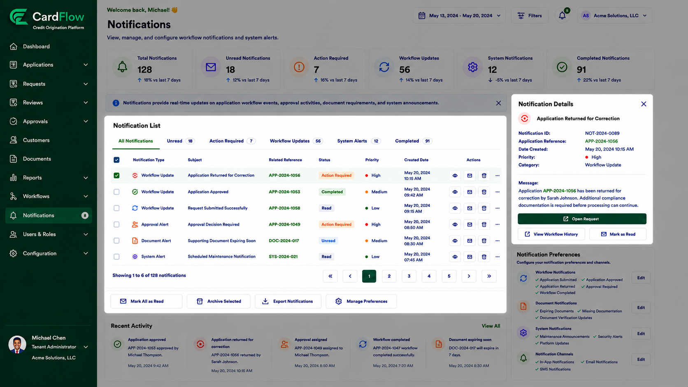

# Reviewing Notification Details
Users can review detailed information associated with a notification.

To review notification details:
1.	Open the **Notifications** page.
2.	Select a notification from the **Notifications List** section.
3.	Review the notification details displayed in the Notification Details panel.
4.	Open the related request or workflow history if required.

The **Notification Details** panel may display:
- Notification ID
- Related application reference
- Notification category
- Priority
- Creation date
- Notification message
- Available actions

**Result**: Users can review notification information and access related workflow records.

*Reviewing Notification Details*
