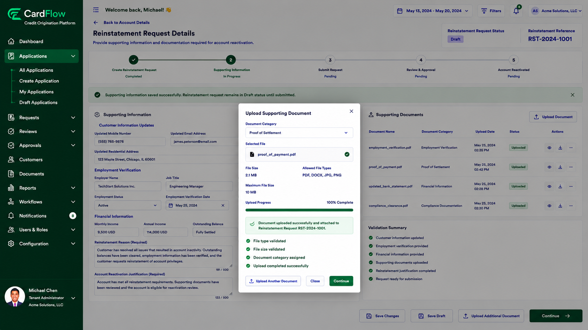

# Providing Supporting Information
Provide supporting details and documentation required to justify the account reactivation request.

To provide supporting information:
1.	Open the reinstatement request.
2.	Navigate to the appropriate section.
3.	Enter the required reinstatement details.
4.	Provide supporting justification.
5.	Upload any required supporting documents.
6.	Save your changes.

Examples of supporting information may include:
- Updated customer contact information
- Employment verification
- Updated financial information
- Proof of payment or settlement
- Compliance documentation
- Account reactivation justification

**Result**: The supporting information is saved and remains editable until the request is submitted.

*Providing Supporting Information*
