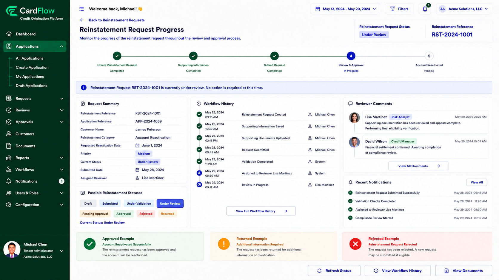

6.5.	Tracking Reinstatement Progress
Monitor the progress of a reinstatement request throughout the review and approval process.
To track reinstatement progress:
1.	Open the reinstatement request.
2.	Review the status displayed on the request.
3.	Monitor the workflow timeline.
4.	Review comments and activities provided by reviewers and approvers.
5.	Check notifications for status updates.

    Typical reinstatement statuses include:
    - Draft
    - Submitted
    - Under Validation
    - Under Review
    - Pending Approval
    - Approved
    - Rejected
    - Returned

**Result**: Users can monitor request progress, review workflow activities, and determine whether additional action is required.

*Tracking Reinstatement Progress*

*Tracking Reinstatement Progress – Returned Reinstatement*