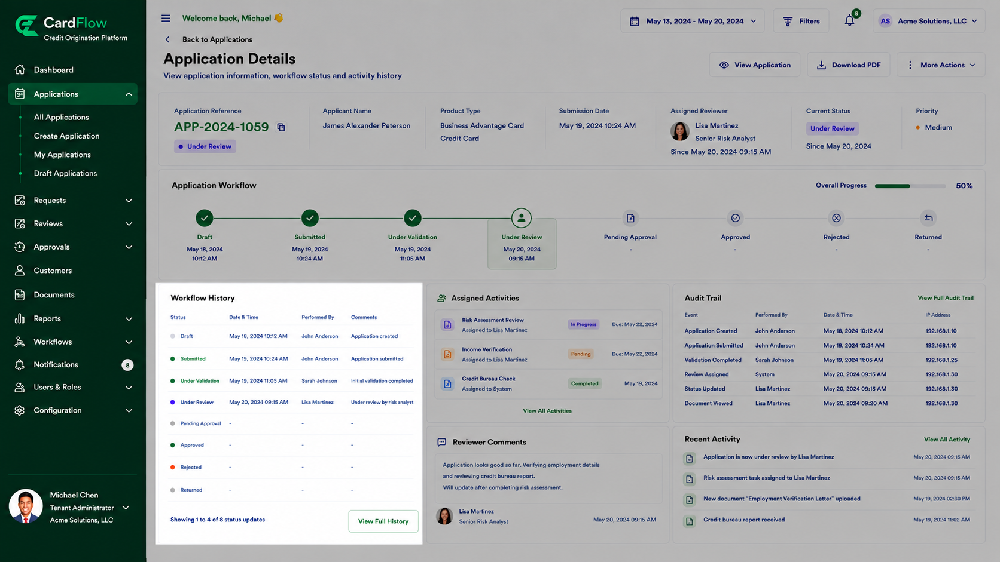

# Viewing Workflow History
Users can review workflow activities associated with an application to understand how the request has progressed through the approval process.
To view workflow history:
1.	Open the required application.
2.	Navigate to the **Workflow History** section.
3.	Review the recorded workflow events.

Workflow history may include:
 
- Application submission
- Reviewer assignments
- Validation activities
- Approval decisions
- Returned requests
- Rejections
- Resubmissions
- Workflow completion events
- Each entry typically displays:
- Activity Date and Time
- User
- Action Performed
- Status Change
- Comments (if applicable)
 
**Result**: The user can view a complete chronological record of workflow activities associated with the request.

*Viewing Workflow History*