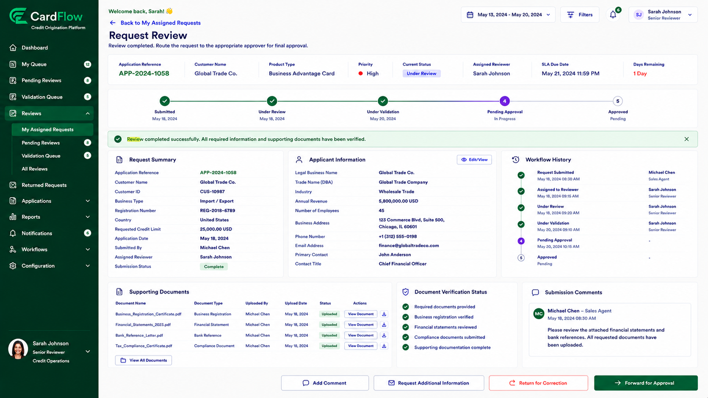

# Forwarding Requests for Approval
Reviewers can forward requests that satisfy review requirements to the approval workflow.

To forward a request for approval:
1.	Open the assigned request.
2.	Verify that all required information is complete.
3.	Verify that supporting documents have been reviewed.
4.	Click **Forward for Approval**.
5.	Confirm the action.
**Result**:
- The request is routed to the appropriate approver.
- The request status changes to Pending Approval.

*Forwarding Requests for Approval*