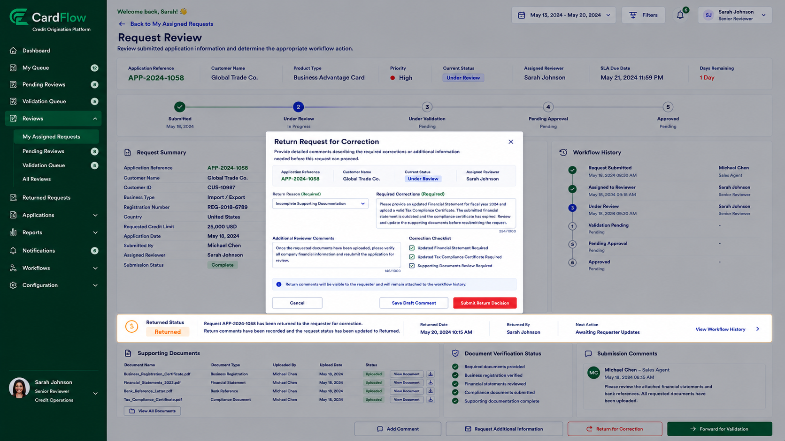

# Returning Returned Requests for Correction
Reviewers can return requests when additional information or corrections are required.

To return a request:
1.	Open the assigned request.
2.	Review the request information and supporting documents.
3.	Click **Return Request**.
4.	Enter the reason for the return.
5.	Specify required corrections or additional documentation.
6.	Click **Submit Return Decision**.

**Result**:
- The request status changes to Returned.
- Return comments become available to the requester.
- The requester may update and resubmit the request.

*Returning Requests for Correction*